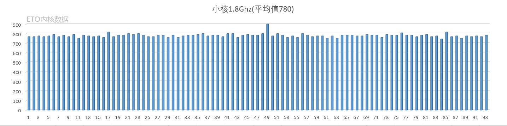
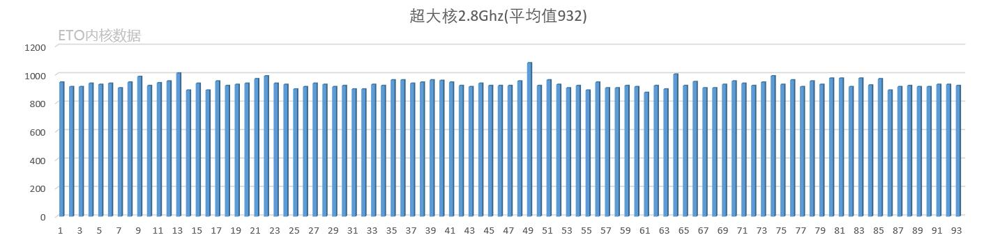

# SM8250_CPU-Voltage

## 记录骁龙865/870三丛核心最高频率的电压

俗称的查看CPU体质，原则上来说核心电压越低体质越好！

***

通过数据可以看出，骁龙865/870的1.8G小核和2.8G超大核，基本都是很稳定，数据基本起伏不大，主要差别还是在2.4Ghz的大核。

如果说真有所谓的CPU体质一说，你的CPU体质好与坏，差不多都是源于2.4Ghz做主要数据。

也就可以简单来说，功耗高不高，主要在于2.4Ghz这个核心。

***

### 210715:

增加了13组数据，感谢群友们提供！

**从当前数据看，平均值小核780、大核941、超大核932。**

870数据太少，所以没统计870的3.18G的数据。

***

### 210710:

找群友获取了80份数据，感谢群友们！！！

可能数据不多，也不是很准确，但是也能说明一些事情。

从图表来看，超大核2.8Ghz基本差不多都是一致的，起伏不大。主要差别还是在小核和大核。

**从当前数据看，平均值小核781、大核942、超大核933。**

就当一娱乐，跟安兔兔跑分一样。所谓的CPU电压小一点，雕一点？其实日常使用差别不大。

***

关于这些CPU电压值:

官方内核是查看不了的，必须是第三方内核，才能查看！

第三方内核添加[cpufreq: qcom-hw: Log reported voltage for each OPP](https://github.com/kdrag0n/proton_kernel_redbull/commit/ec408d18e6c1d9e15092cdd23e97e45a554aaf41)编译出内核刷入即可查看！

***

### 下面是详细数据：

**本数据来自ETO内核群群友贡献，感谢群友们！**

| 小核1.8Ghz | 大核2.4Ghz | 超大核2.8Ghz | 超大核3.18Ghz |
|----------|----------|-----------|------------|
| 768      | 936      | 944       | 1032       |
| 768      | 920      | 912       |            |
| 776      | 936      | 912       |            |
| 768      | 936      | 936       |            |
| 776      | 936      | 928       |            |
| 792      | 952      | 936       |            |
| 768      | 904      | 904       |            |
| 784      | 960      | 944       |            |
| 768      | 936      | 984       | 1080       |
| 792      | 952      | 920       |            |
| 752      | 904      | 940       | 1024       |
| 784      | 968      | 952       |            |
| 776      | 960      | 1008      | 1112       |
| 768      | 912      | 888       |            |
| 776      | 952      | 936       |            |
| 760      | 904      | 888       |            |
| 816      | 992      | 952       |            |
| 768      | 928      | 920       |            |
| 784      | 960      | 928       |            |
| 784      | 952      | 936       |            |
| 800      | 992      | 968       |            |
| 792      | 952      | 988       | 1080       |
| 800      | 968      | 936       |            |
| 784      | 944      | 928       |            |
| 768      | 920      | 896       |            |
| 768      | 928      | 912       |            |
| 784      | 944      | 936       |            |
| 784      | 936      | 928       |            |
| 760      | 928      | 912       |            |
| 784      | 944      | 920       |            |
| 760      | 904      | 896       |            |
| 776      | 928      | 896       |            |
| 784      | 952      | 928       |            |
| 784      | 952      | 920       |            |
| 792      | 976      | 960       |            |
| 800      | 992      | 960       |            |
| 776      | 952      | 936       |            |
| 784      | 952      | 944       |            |
| 784      | 928      | 960       | 1056       |
| 768      | 936      | 956       | 1048       |
| 800      | 960      | 944       |            |
| 800      | 968      | 920       |            |
| 760      | 920      | 912       |            |
| 784      | 936      | 936       |            |
| 792      | 928      | 920       |            |
| 784      | 928      | 920       |            |
| 784      | 928      | 920       |            |
| 800      | 976      | 952       |            |
| 900      | 1007     | 1080      | 1185       |
| 776      | 936      | 920       |            |
| 800      | 976      | 960       |            |
| 784      | 944      | 928       |            |
| 760      | 920      | 904       |            |
| 776      | 952      | 920       |            |
| 760      | 920      | 888       |            |
| 800      | 960      | 944       |            |
| 784      | 920      | 904       |            |
| 768      | 920      | 904       |            |
| 776      | 928      | 920       |            |
| 776      | 904      | 912       |            |
| 752      | 888      | 872       |            |
| 776      | 920      | 920       |            |
| 752      | 912      | 896       |            |
| 784      | 960      | 1000      | 1104       |
| 784      | 936      | 920       |            |
| 784      | 972      | 948       |            |
| 776      | 928      | 904       |            |
| 776      | 928      | 904       |            |
| 792      | 944      | 928       |            |
| 784      | 960      | 952       |            |
| 784      | 952      | 936       |            |
| 760      | 928      | 920       |            |
| 792      | 944      | 944       |            |
| 784      | 952      | 988       | 1088       |
| 784      | 944      | 928       |            |
| 808      | 984      | 960       |            |
| 784      | 936      | 912       |            |
| 784      | 960      | 952       |            |
| 768      | 920      | 928       |            |
| 784      | 944      | 972       | 1064       |
| 792      | 968      | 972       | 1064       |
| 768      | 912      | 912       |            |
| 776      | 920      | 972       | 1072       |
| 744      | 904      | 924       | 1016       |
| 816      | 1000     | 968       |            |
| 768      | 896      | 888       |            |
| 776      | 920      | 912       |            |
| 752      | 952      | 920       |            |
| 776      | 928      | 912       |            |
| 768      | 920      | 912       |            |
| 776      | 960      | 928       |            |
| 768      | 936      | 928       |            |
| 784      | 928      | 920       |            |

